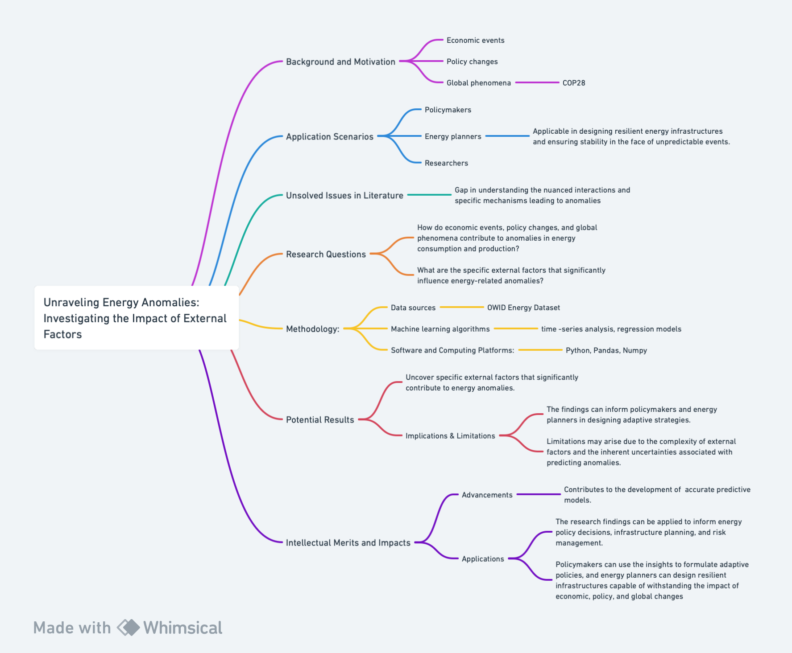

# Understand Literature at the Frontiers of Machine Learning for Social Science.

## 1.1 Paper Analysis

  <kbd>
    
  </kbd>

*Figure 1: Map of the research proposal. Created with Whimsical*

### Introduction of the paper
The selected paper, titled "Power Consumption Predicting and Anomaly Detection Based on Transformer and K-Means" investigates the growing complexity of modern power grids and the changing patterns of electrical energy utilization. Written by Junfeng Zhang, Hui Zhang, Song Ding, and Xiaoxiong Zhang in 2021, the research focuses on monitoring electrical loads for early detection of abnormalities, which is crucial for power grid maintenance and theft prevention. *Figure 1* shows a detailed flowchart of this essay, providing an overview of the research. 

### Background/Motivation
In recent times, the power system has witnessed significant advancements due to the integration of technology and science. The increasing complexity of modern power grids, coupled with a rise in domestic electrical energy demand, necessitates a shift towards intelligent and flexible power systems. Residences and commercial buildings contribute substantially to global electricity use (Desai, 2017). The evolution of the power system towards sustainability prompts the implementation of advanced information transmission technologies for convenient and secure grid processing. However, challenges such as variable energy consumption patterns, anomalies in electrical loads, and power theft create a need for effective monitoring and detection mechanisms (Zhang et.al, 2021).

### Research Question
The research aims to answer the following questions:

1. Can the proposed model effectively predict power consumption over time?
2. How does the combination of the Transformer model and K-means clustering compare to the commonly used LSTM model?
3. What is the anomaly detection performance of the proposed model in comparison to K-means and LSTM?

### Application Scenarios
The research holds importance in several application scenarios, contributing to the enhancement of power grid maintenance, energy savings, and power theft prevention. The findings have implications for identifying abnormal consumption patterns, promoting electricity consumption safety awareness, and improving overall energy efficiency. Given that anomalies in data may indicate malfunctions, the research addresses real-world issues by offering a solution for anomaly detection, particularly in the context of power theft, which accounts for a significant portion of energy loss in some developing countries (Antmann,2009).

The research is inspired by the unsolved challenges in power consumption prediction and anomaly detection. The variability in electric energy usage, the presence of anomalies, and the need for efficient detection methods pose challenges to existing models. Traditional models often focus on univariate prediction and anomaly detection, limiting their applicability in scenarios with diverse variables. While LSTM models have been widely used, they face challenges in processing time series features efficiently.

### Methodology
**Data Source and Datasets:**
The experiment utilizes real hourly electric energy consumption data from a French family spanning 1,440 days.

**Machine Learning Algorithms:**
The proposed methodology combines the Transformer deep learning model with the K-means clustering approach for power consumption prediction and anomaly detection.

**Software and Computing Platforms:**
The research employs machine learning techniques implemented using specific algorithms, with details on software tools and computing platforms not explicitly mentioned.

### Results
The potential findings include:
1. Improved accuracy in power consumption prediction compared to the LSTM model.
2. Enhanced anomaly detection performance utilizing the proposed combination of Transformer and K-means.
3. Evaluation of the model's performance against manually inserted abnormal data points.

The implications of the findings include advancements in power consumption prediction and anomaly detection, particularly in combating power theft. However, the limitations may stem fro potential challenges in applying such findings in different scenarios.

### Intellectual Merits/Practical Impacts
The research advances existing literature by proposing a novel combination of the Transformer model and K-means clustering for improved power consumption prediction and anomaly detection. While showcasing promising results, the study acknowledges limitations and suggests avenues for further research. The research could serve as a seminal paper inspiring future studies on intelligent power systems.

The research has potential applications in real-world scenarios by contributing to more accurate power consumption forecasting and effective anomaly detection. This could aid decision-makers in energy-related fields, enhance energy efficiency, and address issues such as power theft in developing countries. The proposed model presents opportunities for practical implementation in power grid management and electricity consumption safety.

### References
Antmann, P. (2009). Reducing Technical and Non-technical Losses in the Power Sector.

Desai, B. H.(2017). "United Nations Environment Program (Unep)." *Yearbook of International Environmental Law*: 498–505. doi:10.1093/yiel/yvy072.

Zhang, Junfeng, Hui Zhang, Song Ding, and Xiaoxiong Zhang. (2021). "Power Consumption Predicting and Anomaly Detection Based on Transformer and K-Means." *Frontiers in Energy Research*. https://www.frontiersin.org/articles/10.3389/fenrg.2021.779587. DOI: 10.3389/fenrg.2021.779587. ISSN: 2296-598X.

## 1.2 Research idea

  <kbd>
    
  </kbd>

*Figure 1: Map of the research proposal. Created with Whimsical*

### Background/Motivation
As we know, there is an increasing need for energy and environmentally friendly energy options, which has led to an incredibly complex global energy system. Thus, the need of identifying and understanding energy consumption or production anomalies has developed. Economic events, policy changes, and global phenomena can introduce unforeseen disruptions, making it crucial to investigate their impact on energy patterns. Namely, the recent conclusion of the United Nations Climate Change Conference (COP28) in Dubai has set a transformative agenda, marking the "beginning of the end" of the fossil fuel era. “The global commitment to a swift, just, and equitable transition, coupled with the initiation of the world's first 'global stocktake,' has profound implications for the energy landscape” (Worth, 2023). Thus, this research fulfills the need to investigate the impact of external factors, such as policy changes, and global agreements like those arising from COP28, on anomalies in energy consumption and production. 

Understanding the influence of external factors on energy anomalies holds significance for policymakers, energy planners, and researchers. The research intends to contribute to creating knowledgeable and applicable energy models capable of adapting to dynamic external conditions. This knowledge is vital for designing resilient energy infrastructures and ensuring stability in the face of unpredictable events, ultimately fostering global energy sustainability. “Anomaly detection is an unsupervised data processing technique to detect anomalies from the data set” (Kumar, 2023).

While existing literature acknowledges the role of external factors in shaping energy patterns, there is a gap in understanding the nuanced interactions and specific mechanisms leading to anomalies. The complexities involved in quantifying the impact of economic events, policy changes, or global crises on energy consumption and production remain insufficiently explored. Figure 1 shows a detailed flowchart of this essay, providing an overview of the research proposal. 

### Research Question
The research aims to answer the following questions:

1. How do economic events, policy changes, and global phenomena contribute to anomalies in energy consumption and production?
2. What are the specific external factors that significantly influence energy-related anomalies?
3. How can these external factors be quantified and incorporated into predictive models?

### Application Scenarios
The research has potential applications in informing energy policy decisions, guiding infrastructure planning, and enhancing risk management strategies. Insights gained from the study can be applied by policymakers to formulate adaptive policies, ensuring energy security in the face of economic, policy, and global changes.

### Methodology
**Data Source and Datasets:**
Using the dataset on energy consumption and production by the scientific online site Our World in Data (2023), the research will integrate external datasets related to economic indicators, policy changes, and global events. The dataset provides a comprehensive overview of global energy dynamics, including variables related to energy consumption, production, and environmental impact. For example, country names, years, population, GDP, biofuel consumption, coal usage, gas consumption, nuclear power, oil consumption, hydropower, low-carbon energy, renewables, and others (Rosado et.al, 2023). Data preprocessing techniques will be employed to handle missing values and to filter only the necessary data.

**Machine Learning Algorithms:**
For the method of the research itself, it potentially involves advanced machine learning algorithms used specifically for anomaly detection, including regression models, time-series analysis, isolation forest, local outlier factor, robust covariance, or one-class support vector machine (SVM) (Kumar, 2023). A more in depth research of these algorithms is required to identify the most suitable for the research in question. 

**Software and Computing Platforms:**
Python as the primary programming language, leveraging data analysis libraries such as Pandas and NumPy.

### Results
The research expects to identify specific external factors that contribute to energy anomalies. It may reveal patterns or correlations, providing insights into the interactions between economic events, policy changes, and global phenomena with energy consumption and production. Furthermore, the findings can inform policymakers and energy planners to design adaptive strategies. Nonetheless, limitations may arise due to the complexity of external factors and the inherent uncertainties associated with predicting anomalies. Thus, to reduce the complexity of external factors, a focus on the policies resulting from COP28 might be useful to predict future anomalies resulting from such policy changes. 

### Intellectual Merits/Practical Impacts
This research advances existing knowledge by providing a detailed understanding of the impact of external factors on energy-related anomalies. It contributes to more accurate predictive models that anticipate and mitigate the effects of infrequent events on energy systems. The findings can be applied to inform energy policy decisions, infrastructure planning, and risk management. Namely, policymakers can use the insights to formulate adaptive policies, and energy planners can design resilient infrastructures capable of withstanding the impact of economic, policy, and global changes, leading to a sustainable and secure energy system.

### References
Kumar, Satyam. 2023. “5 Anomaly Detection Algorithms to Know”. 
https://builtin.com/machine-learning/anomaly-detection-algorithms

Ritchie, Hannah, Pablo Rosado, and Max Roser. 2023. "Energy." OurWorldInData.org.
https://ourworldindata.org/energy.

Worth, Kiara. 2023. "COP28 Agreement Signals ‘Beginning of the End’ of the Fossil Fuel Era." 
United Nations Climate Change. https://unfccc.int/news/cop28-agreement-signals-beginning-of-the-end-of-the-fossil-fuel-era.
