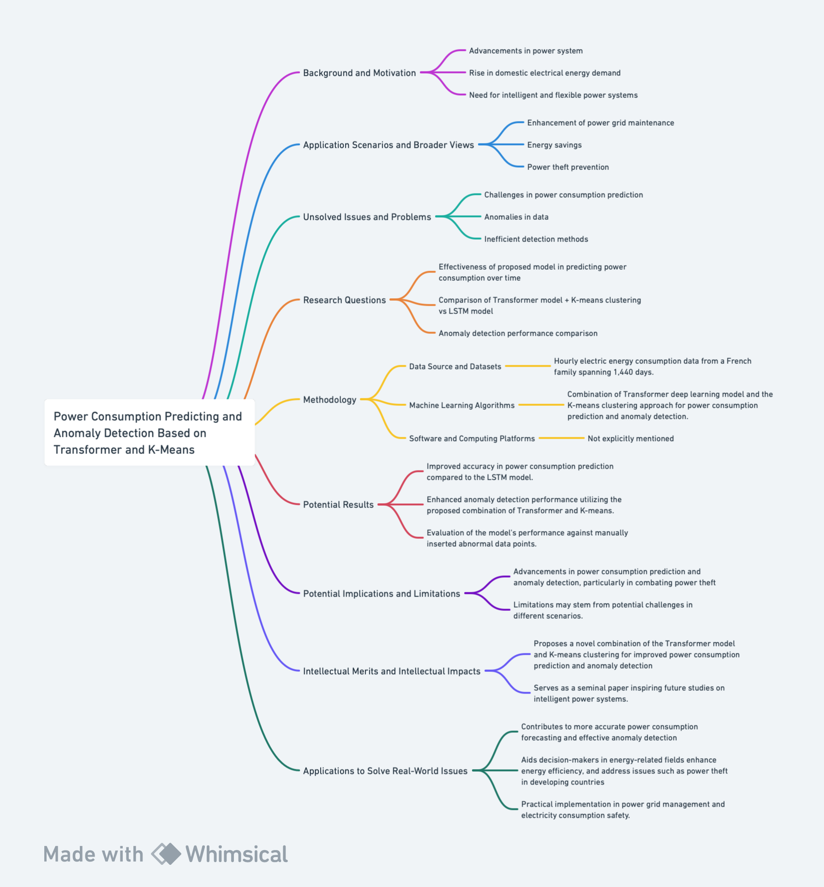

# Understand Literature at the Frontiers of Machine Learning for Social Science.

  <kbd>
    
  </kbd>

*Figure 1: Map of the research proposal. Created with Whimsical*

## 1.1 Paper Analysis

### Introduction of the paper
The selected paper, titled "Power Consumption Predicting and Anomaly Detection Based on Transformer and K-Means" investigates the growing complexity of modern power grids and the changing patterns of electrical energy utilization. Written by Junfeng Zhang, Hui Zhang, Song Ding, and Xiaoxiong Zhang in 2021, the research focuses on monitoring electrical loads for early detection of abnormalities, which is crucial for power grid maintenance and theft prevention. *Figure 1* shows a detailed flowchart of this essay, providing an overview of the research proposal. 

### Background/Motivation
In recent times, the power system has witnessed significant advancements due to the integration of technology and science. The increasing complexity of modern power grids, coupled with a rise in domestic electrical energy demand, necessitates a shift towards intelligent and flexible power systems. Residences and commercial buildings contribute substantially to global electricity use. The evolution of the power system towards sustainability prompts the implementation of advanced information transmission technologies for convenient and secure grid processing. However, challenges such as variable energy consumption patterns, anomalies in electrical loads, and power theft create a need for effective monitoring and detection mechanisms.

### Research Question
The research aims to answer the following questions:

1. Can the proposed model effectively predict power consumption over time?
2. How does the combination of the Transformer model and K-means clustering compare to the commonly used LSTM model?
3. What is the anomaly detection performance of the proposed model in comparison to K-means and LSTM?

### Application Scenarios
The research holds importance in several application scenarios, contributing to the enhancement of power grid maintenance, energy savings, and power theft prevention. The findings have implications for identifying abnormal consumption patterns, promoting electricity consumption safety awareness, and improving overall energy efficiency. Given that anomalies in data may indicate malfunctions, the research addresses real-world issues by offering a solution for anomaly detection, particularly in the context of power theft, which accounts for a significant portion of energy loss in some developing countries.

The research is inspired by the unsolved challenges in power consumption prediction and anomaly detection. The variability in electric energy usage, the presence of anomalies, and the need for efficient detection methods pose challenges to existing models. Traditional models often focus on univariate prediction and anomaly detection, limiting their applicability in scenarios with diverse variables. While LSTM models have been widely used, they face challenges in processing time series features efficiently.

### Methodology
**Data Source and Datasets:**
The experiment utilizes real hourly electric energy consumption data from a French family spanning 1,440 days.

**Machine Learning Algorithms:**
The proposed methodology combines the Transformer deep learning model with the K-means clustering approach for power consumption prediction and anomaly detection.

**Software and Computing Platforms:**
The research employs machine learning techniques implemented using specific algorithms, with details on software tools and computing platforms not explicitly mentioned.

### Results
The potential findings include:
1. Improved accuracy in power consumption prediction compared to the LSTM model.
2. Enhanced anomaly detection performance utilizing the proposed combination of Transformer and K-means.
3. Evaluation of the model's performance against manually inserted abnormal data points.

The implications of the findings include advancements in power consumption prediction and anomaly detection, particularly in combating power theft. However, the limitations may stem fro potential challenges in applying such findings in different scenarios.

### Intellectual Merits/Practical Impacts
The research advances existing literature by proposing a novel combination of the Transformer model and K-means clustering for improved power consumption prediction and anomaly detection. While showcasing promising results, the study acknowledges limitations and suggests avenues for further research. The research could serve as a seminal paper inspiring future studies on intelligent power systems.

The research has potential applications in real-world scenarios by contributing to more accurate power consumption forecasting and effective anomaly detection. This could aid decision-makers in energy-related fields, enhance energy efficiency, and address issues such as power theft in developing countries. The proposed model presents opportunities for practical implementation in power grid management and electricity consumption safety.

### References
Zhang, Junfeng, Hui Zhang, Song Ding, and Xiaoxiong Zhang. "Power Consumption Predicting and Anomaly Detection Based on Transformer and K-Means." *Frontiers in Energy Research* 9 (2021): [Page Range]. https://www.frontiersin.org/articles/10.3389/fenrg.2021.779587. DOI: 10.3389/fenrg.2021.779587. ISSN: 2296-598X.